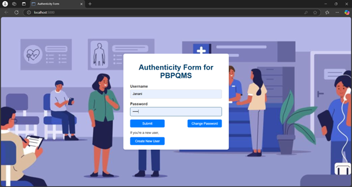
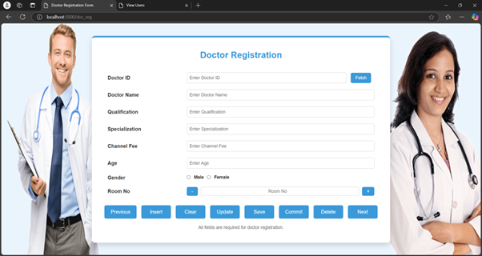

# 🩺 PBPQMS – Protected Buffer-Based Patient Queue Management System

A secure, modular, and buffer-enabled doctor registration and user management system built using **Python Flask** and **Oracle Database**. This application helps hospitals register and manage doctors through a staging mechanism (`Buffer` table) before committing to the final records, ensuring data integrity and admin control.

---

## 🚀 Key Features

### 🔐 User Authentication
- Login using **primary or alternate password**
- Secure role-based access (Doctor, Patient, Receptionist, Pharmacist)
- Password change support for both main and alternate credentials

### 🧑‍⚕️ Doctor Registration Module
- Add, update (single field or full record), delete, and commit doctor data
- Prevent edits or deletion once committed
- Auto-incrementing Doctor IDs (e.g., D001, D002...)
- Gender selector, age input, and room number with spinner
- Navigation support: **Next / Previous Record**
- Dynamic field suggestions via AJAX

### 📋 Buffer Mechanism
- Data is first stored in a `Buffer` table
- Only when "Committed", it moves to the `Doctors` table
- Ensures review before final database insertion

### 👤 User Management
- Register new users with roles
- View existing user list
- Manage user credentials securely

---

## 🛠️ Technology Stack

| Component        | Description                  |
|------------------|------------------------------|
| 🧠 Backend        | Python 3.x with Flask         |
| 🎨 Frontend       | HTML5, CSS3, Vanilla JS       |
| 🗃️ Database       | Oracle (connected via pyodbc) |
| 🔐 Security       | Dual password fields, validation |
| ⚙️ Deployment Ready | Compatible with Docker/Cloud |

---

## 📁 Folder Structure

```

MyOracleDB - MAIN PROJECT/
│
├── app.py                      # Main Flask app
├── requirements.txt            # Python dependencies
├── README.md                   # Project overview
│
├── templates/                  # HTML templates
│   ├── authenticity\_form.html
│   ├── doc\_reg.html
│   ├── buffer\_table.html
│   ├── change\_pwd.html
│   ├── new\_user.html
│   ├── view\_users.html
│   └── view\_records.html
│
├── static/                     # Static files (CSS, images)
│   ├── background.jpg
│   ├── male.png
│   └── female.png

````

---

## 🔧 Getting Started

### 1. Install Requirements

```bash
pip install -r requirements.txt
````

### 2. Set Up Environment Variables (`.env`)

```env
DB_USER=your_db_username
DB_PASSWORD=your_db_password
DBQ=your_host/XE  # e.g., localhost/XE
```

### 3. Run the App

```bash
python app.py
```

Visit `http://127.0.0.1:5000` in your browser.

---

## 📷 Screenshots

### 🔐 Login Page


### 🧑‍⚕️ Doctor Form


---

## 👩‍💻 Author

**Janani A**
📧 \[[YourEmail@example.com](mailto:jananianbalagan2406@example.com)]
🌐 GitHub: [@Janani2405](https://github.com/Janani2405)

---

## 📜 License

This project is licensed under the **MIT License**.

---


